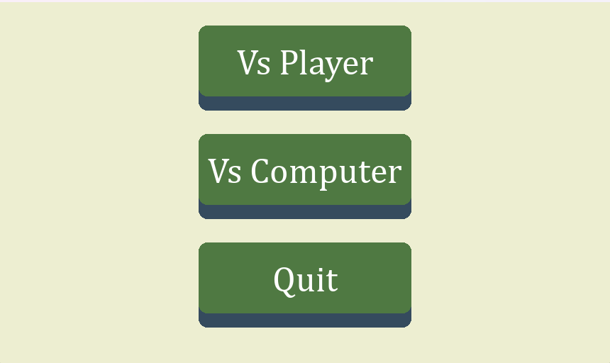
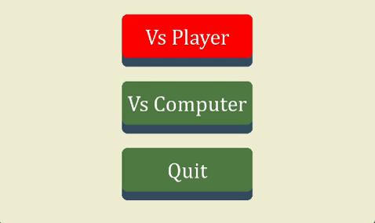
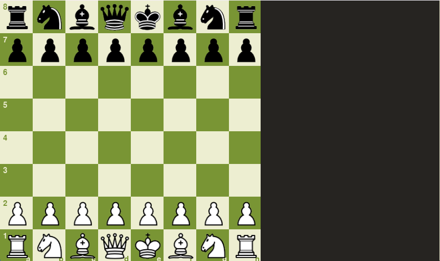
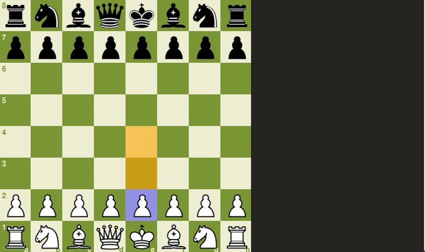
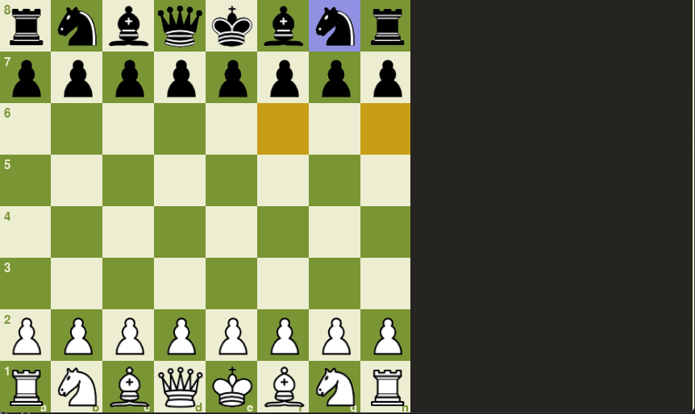
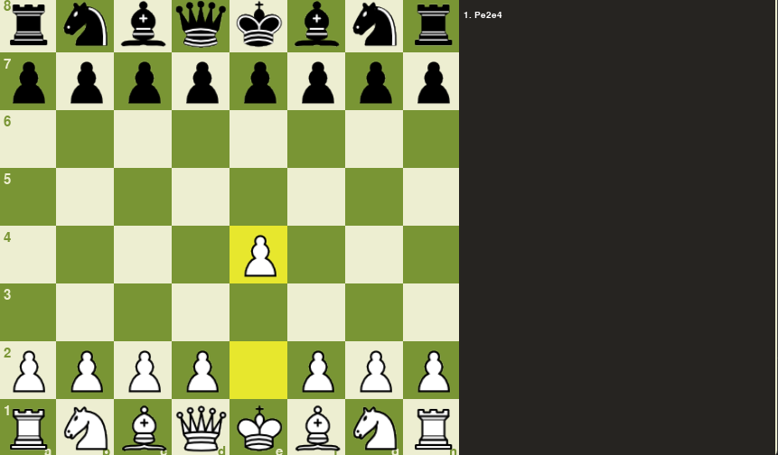
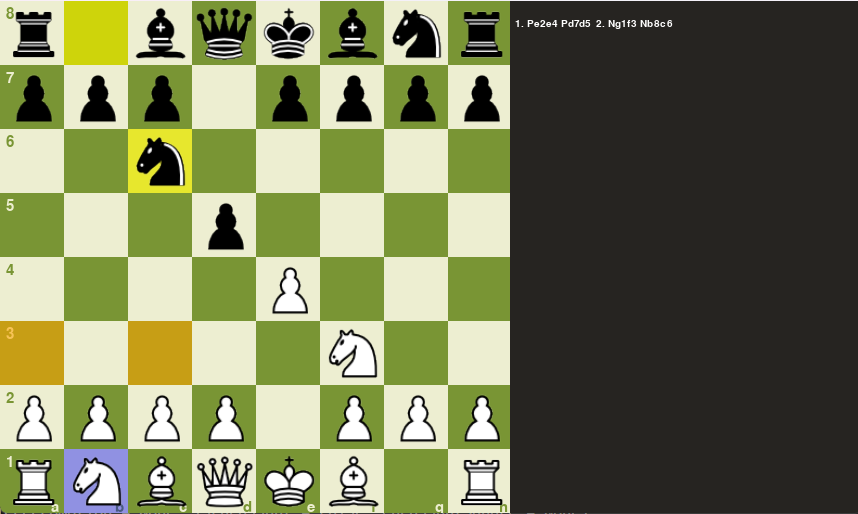
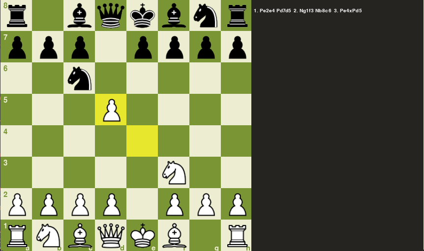

## Chess pygame
Chess game using pygame. Fuctionalites include:
- vs Player
- vs Computer (MinMax/NegaMax with alpha-beta pruning)

# Required installation
```python
pip install pygame
```
# Running the Program
```python
py main.py
```

## Description 
When the program is opened, the user will be given options to battle against another player (locally), or against an AI.



The buttons are also animated. It will change color when you hover the mouse to the button, and perform a "pressing down" animation when you click on it



Once an option is decided, the main chess screen will appear. By default, white will always move first



To identify the possible moves a chess Piece could make, click on the chess iece and the available moves will be highlighted in orange.



You can also see the opponent's possible moves.



Once a move is made, a yellow highlight will appear on the board of the chess Piece last and new position. There
are also sound effects and animation for each move, whether it is a normal move or a capture.



The right side of the screen displays the move made in chess Notation
<table>
  <tr>
    <td></td>
    <td></td>
  </tr>
 </table>

The Notation is as follows:

- Basic Move: [Piece Moved][Start Location][End Location]

- Capture Move: [Piece Moved][Start Location][End Location]x[PieceCaptured][Piece Captured Position]

where PieceMoved = 

 - **P** : *Pawn*
 - **R** : *Rook*
 - **B** : *Bishop*
 - **N** : *Knight*
 - **Q** : *Queen*
 - **K** : *King*

# Controls:

**Left Click** - Select and Move a chess Piece 

**Right Click** - Undo Move

  - If the opponent is an A.I, it will also undo the A.I last move if necessary. This is to prevent the A.I thinking/making a move directly after user undo.

**R** - Reset the entire Board

**Esc** - Exit the current Chess game

---
## Additional information
The program uses MinMax and NegaMax variant with alpha-beta pruning as the thought process. By default, the AI can think two steps ahead. 
This can be changed by changing the depth, but higher depth would increase time taken for the A.I to make a decision exponentially.

Special moves included:
- Pawn Promotion
- En Passant
